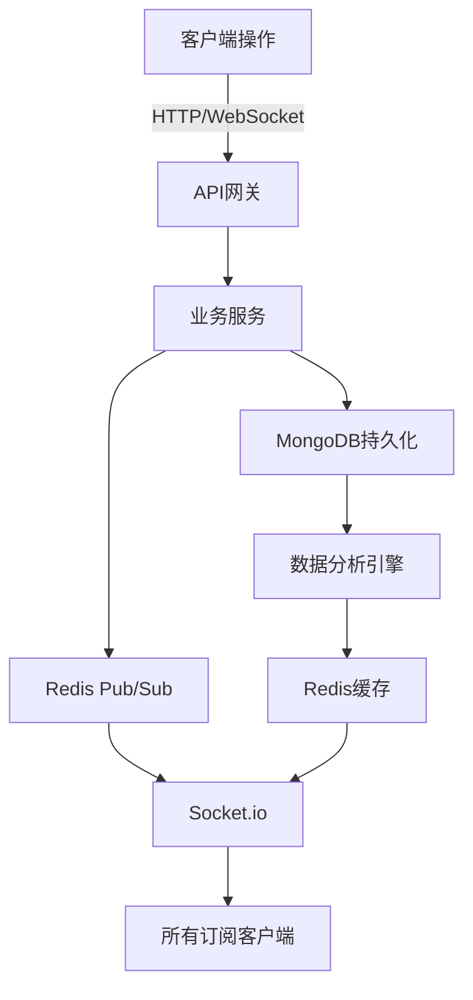

## 产品概述

Event_Control_System v2.0.0-pro 是一款企业级赛事控制系统，专为专业体育赛事提供完整的计分、计时、数据分析和大屏投放解决方案。

## 核心功能

- **多角色认证管理**：支持管理员、裁判员、操作员、观众等角色的RBAC权限控制
- **赛事全周期管理**：创建、配置、进行中和结束的完整赛事生命周期管理
- **专项运动计分板**：篮球（得分/犯规/暂停）、足球（进球/黄牌/红牌）等专项规则引擎
- **毫秒级计时系统**：支持倒计时/正计时、精确到毫秒级别的时间控制
- **实时数据分析**：多维度数据看板、趋势图表、实时统计和历史对比
- **大屏导播控制**：多场景布局切换、实时画面合成、外部视频源接入
- **智能回放集锦**：关键时刻自动标记、多视角回放、集锦生成与导出
- **第三方系统对接**：硬件设备API、数据同步、外部系统集成
- **审计日志系统**：完整操作记录、数据追踪、安全审计

## 性能要求

- 支持WebSocket实时通信，延迟<100ms
- 7x24小时连续稳定运行
- 支持50+并发连接
- 数据持久化与高可用性保障

## 技术栈选择

### 前端技术

- **框架**: React 18 + TypeScript + Vite
- **UI组件库**: Ant Design Pro（企业级中后台解决方案）
- **状态管理**: Zustand（轻量级）+ React Query（数据缓存）
- **实时通信**: Socket.io-client
- **图表库**: ECharts + Ant Design Charts
- **样式方案**: Ant Design + CSS Modules

### 后端技术

- **运行时**: Node.js 20 LTS
- **框架**: Express.js 4.x + TypeScript
- **实时通信**: Socket.io 4.x
- **数据库**: MongoDB 6.x（主数据存储）
- **缓存**: Redis 7.x（实时数据、会话、速率限制）
- **认证**: JWT + bcrypt + Redis会话管理
- **日志**: Winston + Morgan
- **API文档**: Swagger/OpenAPI

### 基础设施

- **进程管理**: PM2
- **部署**: Docker + Docker Compose
- **监控**: Prometheus + Grafana

## 架构设计

### 系统架构

采用微服务化单体架构（Modular Monolith），按功能模块垂直拆分，保持部署简洁性的同时实现逻辑解耦。

```
┌─────────────────────────────────────────────────────────────┐
│                     客户端层 (React)                        │
│  ┌─────────┐  ┌─────────┐  ┌─────────┐  ┌─────────┐      │
│  │  Web端  │  │  大屏端  │  │  移动端  │  │  API端  │      │
│  └────┬────┘  └────┬────┘  └────┬────┘  └────┬────┘      │
└───────┼────────────┼────────────┼────────────┼─────────────┘
        │            │            │            │
┌───────▼────────────▼────────────▼────────────▼─────────────┐
│                 API网关层 (Nginx/Express)                   │
│  ┌──────────┐  ┌──────────┐  ┌──────────┐  ┌──────────┐  │
│  │ 认证服务 │  │ 赛事服务 │  │ 计分服务 │  │ 数据服务 │  │
│  └────┬─────┘  └────┬─────┘  └────┬─────┘  └────┬─────┘  │
└───────┼─────────────┼─────────────┼─────────────┼─────────┘
        │             │             │             │
┌───────▼─────────────▼─────────────▼─────────────▼─────────┐
│              业务逻辑层 (Socket.io + Redis)               │
│  实时事件总线、规则引擎、状态管理、消息队列                 │
└───────┬─────────────────────────────────────────────────────┘
        │
┌───────▼─────────────────────────────────────────────────────┐
│              数据存储层 (MongoDB + Redis)                   │
│  主数据库、缓存、会话、实时数据、审计日志                   │
└─────────────────────────────────────────────────────────────┘
```

### 模块划分

1. **认证授权模块**: JWT认证、RBAC权限、多角色管理
2. **赛事管理模块**: CRUD操作、赛事配置、状态流转
3. **计分引擎模块**: 规则引擎、运动专项逻辑、实时计算
4. **计时系统模块**: 高精度计时、倒计时控制、时间同步
5. **实时通信模块**: WebSocket连接、房间管理、事件广播
6. **数据分析模块**: 聚合计算、趋势分析、报表生成
7. **大屏控制模块**: 布局管理、场景切换、视频合成
8. **日志审计模块**: 操作日志、数据追踪、安全审计

### 实时数据流



### 性能优化策略

- **缓存策略**: Redis多级缓存（会话、实时数据、热点数据）
- **数据库优化**: MongoDB索引优化、读写分离、分片集群
- **实时通信**: Socket.io房间管理、二进制传输、心跳检测
- **负载均衡**: 多节点部署、Sticky Session、Redis共享状态
- **限流熔断**: Redis限流、熔断降级、优雅降级

## 关键接口设计

### WebSocket事件规范

```typescript
// 事件命名空间
enum EventNamespace {
  SCORE = 'score',
  TIMER = 'timer',
  GAME = 'game',
  CONTROL = 'control'
}

// 核心事件类型
interface ScoreUpdateEvent {
  event: 'score:update';
  data: {
    matchId: string;
    teamId: string;
    score: number;
    timestamp: number;
  };
}

interface TimerSyncEvent {
  event: 'timer:sync';
  data: {
    matchId: string;
    elapsed: number;
    remaining: number;
    status: 'running' | 'paused' | 'stopped';
  };
}
```

### REST API规范

- 认证接口: `/api/auth/*`
- 赛事接口: `/api/matches/*`
- 计分接口: `/api/score/*`
- 数据接口: `/api/analytics/*`
- 控制接口: `/api/control/*`

## 目录结构

```
d:/Event_Control_System/
├── client/                           # 前端项目
│   ├── src/
│   │   ├── components/               # 公共组件
│   │   │   ├── Auth/                 # 认证组件
│   │   │   ├── Scoreboard/           # 计分板组件
│   │   │   ├── Timer/                # 计时器组件
│   │   │   └── Dashboard/            # 数据看板组件
│   │   ├── pages/                    # 页面
│   │   │   ├── Login/                # 登录页
│   │   │   ├── Dashboard/            # 控制台首页
│   │   │   ├── Match/                # 赛事管理
│   │   │   ├── Control/              # 导播控制
│   │   │   └── Display/              # 大屏展示
│   │   ├── stores/                   # 状态管理
│   │   ├── services/                 # API服务
│   │   ├── utils/                    # 工具函数
│   │   ├── types/                    # TypeScript类型
│   │   └── App.tsx                   # 根组件
│   ├── public/                       # 静态资源
│   ├── package.json
│   └── vite.config.ts
├── server/                           # 后端项目
│   ├── src/
│   │   ├── config/                   # 配置文件
│   │   ├── controllers/              # 控制器
│   │   ├── services/                 # 业务服务
│   │   ├── models/                   # 数据模型
│   │   ├── middleware/               # 中间件
│   │   ├── sockets/                  # WebSocket处理
│   │   ├── routes/                   # 路由
│   │   ├── utils/                    # 工具
│   │   ├── types/                    # 类型定义
│   │   └── app.ts                    # 入口
│   ├── tests/                        # 测试
│   ├── package.json
│   └── tsconfig.json
├── shared/                           # 共享类型和常量
│   ├── types/                        # 共享类型定义
│   └── constants/                    # 共享常量
├── docker/                           # Docker配置
├── docs/                             # 文档
├── scripts/                          # 脚本
├── package.json                      # 根包管理
└── docker-compose.yml                # Docker编排
```

## 设计理念

采用专业赛事级UI设计，融合科技感与实用性，确保在高压力赛事环境下的操作准确性和视觉清晰度。整体设计以深色主题为主，配合霓虹蓝和荧光绿作为强调色，营造专业竞技氛围。

## 设计架构

基于React 18 + TypeScript + Ant Design Pro构建企业级中后台界面，采用组件化设计思想，确保模块高度复用和可扩展性。针对赛事控制场景优化交互流程，所有关键操作均支持快捷键和二次确认，防止误操作。

### 页面规划

1. **登录页**: 角色选择 + 认证 + 系统状态展示
2. **控制台首页**: 实时数据看板 + 快速入口 + 系统监控
3. **赛事管理页**: 赛事列表 + 配置 + 状态控制
4. **计分控制页**: 专项计分面板 + 实时数据 + 操作日志
5. **导播控制页**: 多画面布局 + 场景切换 + 设备控制
6. **大屏展示页**: 全屏计分板 + 动画效果 + 品牌展示

### 布局系统

- **顶部导航**: 系统Logo + 当前赛事信息 + 用户状态 + 系统时间
- **侧边导航**: 模块化菜单 + 快捷工具 + 系统状态指示
- **主内容区**: 卡片式布局 + 响应式网格 + 实时数据流
- **底部控制栏**: 全局操作 + 快捷键提示 + 通知中心

### 交互设计

- **实时反馈**: 所有操作提供即时视觉/音效反馈
- **防误触**: 关键操作二次确认 + 撤销机制
- **快捷键**: 完整的键盘快捷键系统
- **手势支持**: 触控优化（针对平板操作场景）
- **动画效果**: 微交互动画 + 状态过渡 + 数据更新动画

## Agent Extensions

### Skill

- **skill-creator**
- Purpose: 创建项目开发规范、代码模板和最佳实践文档
- Expected outcome: 生成TypeScript编码规范、React组件开发模板、Git工作流指南、API设计规范

### SubAgent

- **code-explorer**
- Purpose: 在后续开发中探索代码模式、查找相似实现、批量重构
- Expected outcome: 快速定位代码位置、分析依赖关系、确保代码一致性